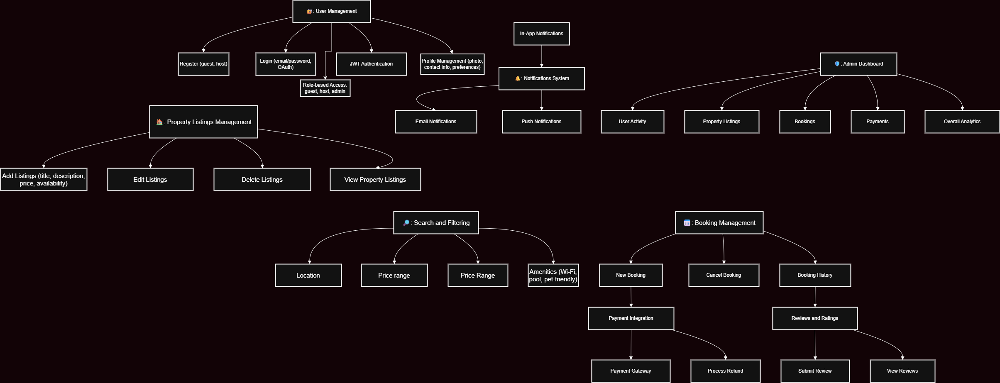

# Airbnb Clone Backend - Features and Functionalities

This document summarizes all the key features and system functionalities that the backend of the Airbnb Clone will support.

## 🔑 Core Functionalities

- User Registration, Login, Profile Management
- Property Listing Creation, Update, Deletion
- Search and Filtering by location, price, amenities
- Booking Creation, Cancellation, Status Tracking
- Payment Processing with Secure Gateways
- Review and Rating System
- Notification System (email, in-app)
- Admin Dashboard for full control

## 🛠️ Technical Requirements

- RESTful API (optionally GraphQL)
- PostgreSQL/MySQL Database
- JWT Authentication & RBAC
- File Upload (Cloud or Local)
- Error Handling & Logging
- Third-party APIs (Email, Payment)

## 🚀 Non-Functional Requirements

- Scalability (modular, load-balanced)
- Security (encryption, rate limiting)
- Performance (Redis, DB optimization)
- Testing (unit, integration, automated)

